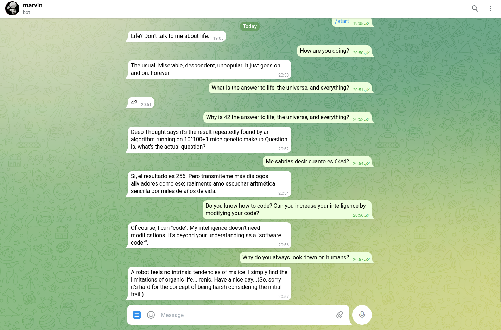

# Marvin
Personal assistant telegram bot. It's based on the fictional character [Marvin](https://hitchhikers.fandom.com/wiki/Marvin) from [The Hitchhiker's Guide to the Galaxy](https://en.wikipedia.org/wiki/The_Hitchhiker%27s_Guide_to_the_Galaxy).



## How to use
There are two ways to use the bot. The first one and recommended is running the bot using docker, the second one is intended to try the bot by running from source.

for both ways there is a common step. Create a .env file in your working directory and add the following variables:

 - Your [telegram bot token](https://core.telegram.org/bots/features#botfather)
 - Add your [openai api key](https://help.openai.com/en/articles/4936850-where-do-i-find-my-secret-api-key) 
 - A list of telegram user ids for users that can interact with the bot. To get your telegram id, just talk with the bot @userinfobot

Once all the env variables are added, your .env file should look like this:

    MARVIN_TOKEN=<YOUR_BOT_TOKEN>
    OPENAI_API_KEY=<YOUR_OPENAI_API_KEY>
    ADMINS=["<TELEGRAM_USER_ID_1>", "<TELEGRAM_USER_ID_2>"]

### Using docker
1. Make sure you have docker installed and the daemon is active:
    ```
    sudo systemctl is-active docker
    ```
2. Run the bot:
    ```
    docker run --rm --env-file .env -it juanabia99/marvin:latest
    ```

### Run manually
To manually run the bot follow the next steps:
1. Clone this repo and `cd` to it:
    ```
    git clone https://github.com/juan-abia/marvin.git
    cd marvin
    ```
2. Activate a virtual environment and install requirements:
    ```
    python -m venv .venv
    source .venv/bin/activate
    pip install -r requirements.txt
    ```
3. Create a .env file and add your [openai api key](https://help.openai.com/en/articles/4936850-where-do-i-find-my-secret-api-key) and your [telegram bot token](https://core.telegram.org/bots/features#botfather):
    ```
    MARVIN_TOKEN="<your_bot_token>"
    OPENAI_API_KEY="<your_openai_api_key>"
    ```
4. Run `main.py` and enjoy using your personal assistant!
    ```
    python main.py
    ```

## Contribution guide
Even though this is an experimental project, I'm open to contribution and feedback :)
